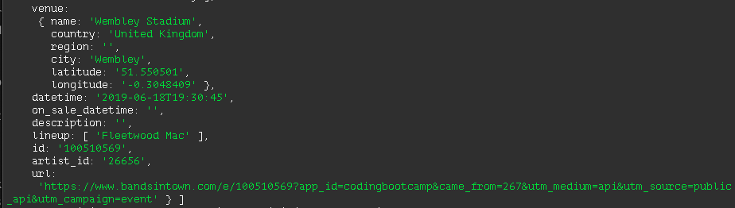

# LIRI-node-app

### LIRI, the command line node app that takes in parameters and gives you back data. LIRI will search Spotify for songs, Bands in Town for concerts, and OMDB for movies.

### Created by Christie Byrne

## Purpose of the game
To retrieve the data that powers this app, I sent requests to the Bands in Town, Spotify and OMDB APIs. 

<a src= "https://byrnec.github.io/liri-node-app/" target = " "> Try it out here!</a>

## Getting Started

- Clone down repo.
- Run command 'npm install' in Terminal 
- Run command 'node liri.js' or one of the commands below.

#### Bands in Town
`node liri.js concert-this <insert artist name>`

This will show this username's last 20 tweets and when they were created at in your terminal/bash window.

#### Spotify
`node liri.js spotify-this-song <insert song title>`

This will show the following information about the song in your terminal/bash window

- Artist(s)
- The song's name
- A preview link of the song from Spotify
- The album that the song is from

If no song is provided then your program will default to "The Sign" by Ace of Base

#### Movies
`node liri.js movie-this <insert movie title>`

This will output the following information to your terminal/bash window:

- Title of the movie.
- Year the movie came out.
- IMDB Rating of the movie.
- Country where the movie was produced.
- Language of the movie.
- Plot of the movie.
- Actors in the movie.
- Rotten Tomatoes Rating.
- Rotten Tomatoes URL.

If the user doesn't type a movie in, the program will output data for the movie 'Mr. Nobody.'

#### Do What It Says
`node liri.js do-what-it-says`

Using the `fs` Node package, LIRI will take the text inside of random.txt and then use it to call one of LIRI's commands.

Right now it will run `spotify-this-song` for "I Want it That Way,".

Feel free to change the text in that document to test out the feature for other commands.

## Built With

- Sublime Text - Text Editor
- JavaScript
- Node.js - Download the latest version of Node https://nodejs.org/en/
- dotenv package
- Spotify NPM Package - https://www.npmjs.com/package/spotify
- Request NPM Package - https://www.npmjs.com/package/request
- Moment.js